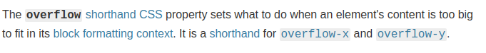
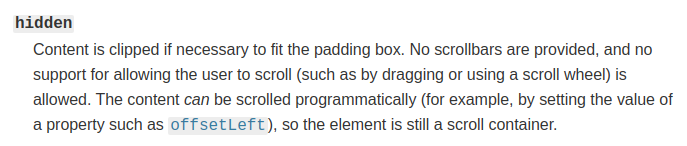
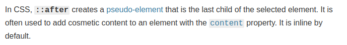

# Hamburger Menu

- Link of the project: https://kevschmidt.github.io/hamburer-menu/
- Clone the repository: ``` git clone git@github.com:kevSchmidt/hamburer-menu.git ```

### Tools:
<h1>

</h1>

### Preview:


### We hide the content outside of the viewport and make it appear with smooth transition.

#### Overflow:




#### Pseudo class:



### Code And Create:

https://www.youtube.com/channel/UCtOmmC3Z8WSn45VgTAKBHhA
